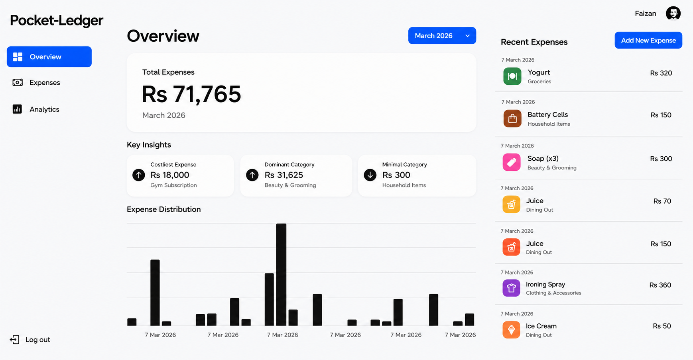

# Pocket Ledger

A personal portfolio project that delivers a modern, intuitive expense tracking application. Pocket Ledger helps users take control of their finances through comprehensive expense monitoring, detailed spending analysis, and actionable insights into financial habits - all wrapped in a sleek, user-friendly interface.

## 🌐 Live Demo

[View Live Application](https://pocket-ledger-peach.vercel.app)

## 📸 Snippet



## ✨ Features

### Comprehensive Expense Management

- 🧾 Easy expense entry with detailed categorization
- 📋 View, edit, and delete expense records
- 🏷️ Diverse categorization system with 11 preset categories
- 💼 Multi-currency support with 18 major currencies

### Advanced Analytics

- 📊 Interactive charts and visualizations
- 📈 Monthly spending patterns analysis
- 🎯 Category-wise expense breakdown
- 💡 Smart insights on spending habits

### User Experience

- 🌙 Modern, clean interface
- 📱 Fully responsive design for all devices
- ⚡ Real-time updates and smooth transitions
- 🔍 Advanced filtering and sorting capabilities
- 📲 Installable as a Progressive Web App (PWA)

### Security & Authentication

- 🔒 Secure authentication via Google and GitHub
- 🔐 Protected routes and data privacy
- 👤 Personalized user profiles

## 🚀 Getting Started

### Prerequisites

- Node.js 18.0 or higher
- npm or yarn package manager
- A modern web browser

### Installation

1. Clone the repository:

```bash
git clone https://github.com/thisisfaizanali/pocket-ledger.git
```

2. Navigate to the project directory:

```bash
cd pocket-ledger
```

3. Install dependencies

```bash
npm install
# or
yarn install
```

4. Set up environment variables:

Create a `.env.local` file in the root directory and add the following variables:

```bash
# Auth Providers
AUTH_GOOGLE_ID=your_google_client_id
AUTH_GOOGLE_SECRET=your_google_client_secret

AUTH_GITHUB_ID=your_github_client_id
AUTH_GITHUB_SECRET=your_github_client_secret

# Database
DATABASE_URL=your_database_url

# Auth
AUTH_SECRET=your_auth_secret
```

5. Run the development server

```bash
npm run dev
# or
yarn dev
```

6. Open http://localhost:3000 in your browser.

## 🛠️ Tech Stack

### Frontend

- **Next.js** - React framework for production
- **React** - UI library
- **TypeScript** - Static typing
- **Tailwind CSS** - Utility-first CSS framework
- **shadcn/ui** - UI component library
- **Recharts** - Chart library for data visualization
- **React Hook Form** - Form handling
- **Zod** - Schema validation

### Backend & Database

- **Prisma ORM** - Type-safe database toolkit
- **PostgreSQL (Neon)** - Serverless cloud database

### Authentication

- **Auth.js (NextAuth)** - Authentication and session management
- Support for Google and GitHub providers

### Deployment

- **Vercel** - Application hosting and deployment
- **PWA** - Progressive Web App support

### Development Tools

- ESLint - Code linting
- Prettier - Code formatting
- Husky - Git hooks
- PostCSS - CSS processing

## 📱 Responsive Design

Pocket Ledger is built with a desktop-first approach, ensuring a seamless experience across all devices.

## 🎨 Customization

### Theme Configuration

The application uses a custom theme with the following color palette:

```css
:root {
  --primary: #bde9c9;
  --secondary: #2d8c47;
  --accent: #ea5166;
  --neutral: #fcf9e0;
}
```

## 📝 Project Structure

```text
pocket-ledger/
├── src/
│   ├── app/                             # Next.js app directory
│   ├── components/                      # React components
│   │   ├── feature/                     # Feature-specific components
│   │   │   ├── analytics/               # Analytics page components
│   │   │   ├── expenses/                # Expenses page components
│   │   │   └── overview/                # Overview page components
│   │   ├── layout/                      # Layout components
│   │   └── ui/                          # Reusable UI components
│   │       ├── shadcn/                  # shadcn/ui components
│   ├── fonts/                           # Custom font files
│   ├── lib/                             # Core utility functions
│   ├── styles/                          # Styling files
│   └── utils/                           # Helper functions
```
